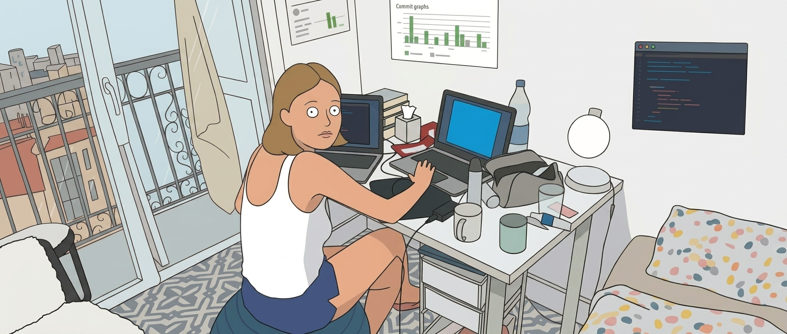

  

## About me 💡

I am Svetlana Titovskaia. Three years ago I decided to start my journey
in the technological sector as a software engineer.

To do so, I am studying at <a href="https://www.42malaga.com/">42 Málaga Fundación Telefónica</a>, where we develop technical skills by completing full projects and refining our soft skills. Below you can see a repository of those projects, where I try to organize them and make it more accessible and clear to anyone looking. 

I have a varied and wide background in other fields that, in my humble opinion, translates well to programming and adds valuable perspectives to my capabilities.
Feel free to contact me! You can do it here, through my <a href="mailto:your.svetlanatitovskaia@gmail.com">email</a> or on <a href="https://www.linkedin.com/in/svetameanssun/">LinkedIn</a> 

## 42 Projects Shortcuts

## 42 Profile

